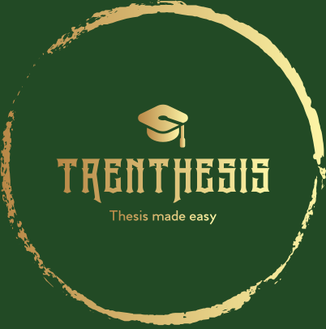

# TrenThesis

This is the README file for the TrenThesis project. Further information at https://github.com/MassimoGirondi/TrenThesis/wiki.

## Project scope
The purpose of this project is to create a platform that allows students and professors to interact on the thesis subject. Furthermore, it allows the university to visualize statistics about topics, students and professors. 
